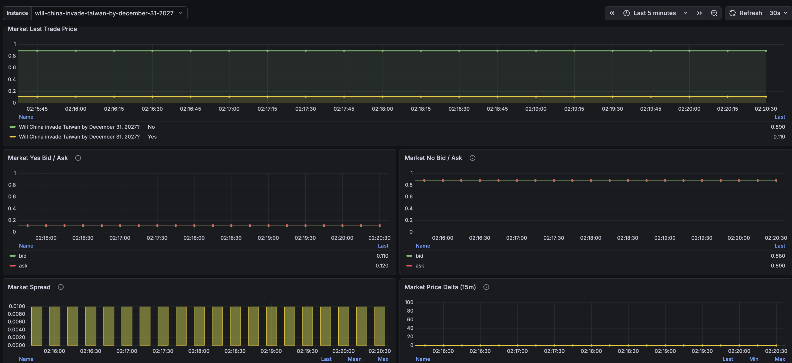
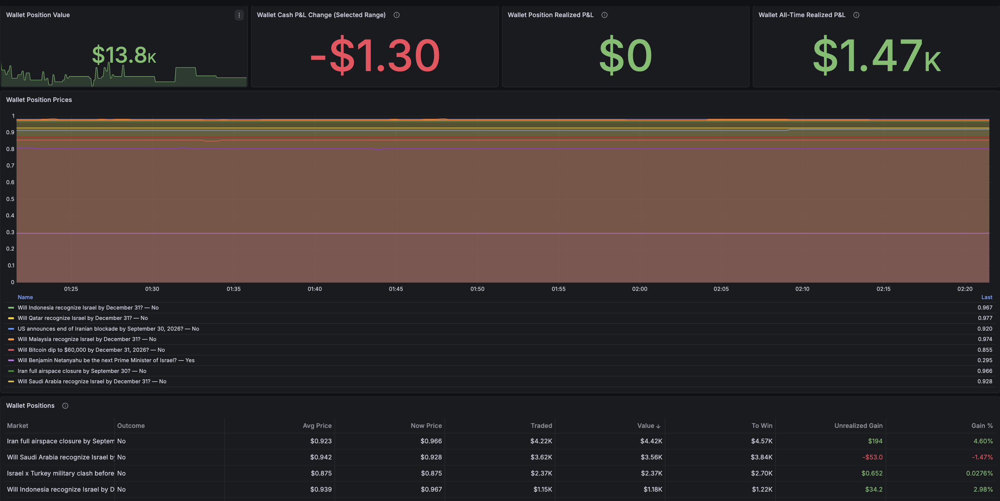

# Polymarket Exporter

Prometheus metrics exporter for [Polymarket](https://polymarket.com) prediction markets. Streams real-time market prices via WebSocket and polls REST APIs for market data and wallet positions.

```
Prometheus  ──scrape──>  polymarket-exporter  ──REST+WS──>  Polymarket APIs
                              :9184
```

## Features

- Real-time bid/ask/price updates via WebSocket streaming
- REST polling for open interest, top 20 holders, and wallet positions
- Built-in rate limiting per Polymarket API endpoint
- Prometheus [multi-target exporter pattern](https://prometheus.io/docs/guides/multi-target-exporter/) — monitor any market by slug ([How to extract the slug](https://docs.polymarket.com/market-data/fetching-markets#how-to-extract-the-slug))
- Exporter health metrics (active slugs, WebSocket connection status)
- Graceful shutdown (SIGTERM / Ctrl-C)

## Installation

### Docker

```bash
docker pull ghcr.io/prophet-spaces/polymarket-exporter:latest
docker run -p 9184:9184 ghcr.io/prophet-spaces/polymarket-exporter:latest
```

Multi-arch images are available for `linux/amd64` and `linux/arm64`.

### Binary releases

Pre-built binaries are available on the [Releases](https://github.com/prophet-spaces/polymarket-exporter/releases)

```bash
tar xzf polymarket-exporter-*.tar.gz
./polymarket-exporter
```

### Build from source

Requires [Rust](https://rustup.rs/) toolchain.

```bash
cargo build --release
./target/release/polymarket-exporter
```

### Quick test

```bash
curl -s "http://127.0.0.1:9184/probe?target=<slug>"
```

## Usage

```
polymarket-exporter [OPTIONS]

Options:
  -c, --config <PATH>   Path to config file [default: config.toml] [env: CONFIG_PATH]
  -l, --listen <ADDR>   Override listen address [env: LISTEN_ADDR]
  -h, --help            Print help
```

Set `RUST_LOG` to control log verbosity (default: `polymarket_exporter=info,warn`).

## Configuration

Configuration is **optional** — sensible defaults are used when no config file is found.

To customize, copy the example and edit:

```bash
cp config.toml.example config.toml
```

## Endpoints

| Endpoint                                    | Description                                                   |
|---------------------------------------------|---------------------------------------------------------------|
| `GET /probe?target=<slug>`                  | Returns Prometheus metrics for a market slug (default module) |
| `GET /probe?module=wallet&target=<address>` | Returns metrics for a wallet's open positions                 |
| `GET /metrics`                              | Returns exporter health metrics                               |

## Metrics

### Market metrics (`/probe`)

| Metric                         | Type  | Labels                                      | Description                         |
|--------------------------------|-------|---------------------------------------------|-------------------------------------|
| `polymarket_market_spread_bid`        | gauge | question, outcome, token_id                 | Bid price closest to the spread     |
| `polymarket_market_spread_ask`        | gauge | question, outcome, token_id                 | Ask price closest to the spread     |
| `polymarket_market_spread`            | gauge | question, outcome, token_id                 | Bid-ask spread                      |
| `polymarket_market_last_trade_price`  | gauge | question, outcome, token_id                 | Last trade price                    |
| `polymarket_market_tick_size`         | gauge | question, outcome, token_id                 | Minimum tick size                   |
| `polymarket_market_min_order_size`    | gauge | question, outcome, token_id                 | Minimum order size                  |
| `polymarket_market_fee_rate_bps`      | gauge | question, outcome, token_id                 | Fee rate in basis points            |
| `polymarket_market_open_interest`     | gauge | question, condition_id                      | Open interest value                 |
| `polymarket_market_top_holder_amount` | gauge | question, outcome, holder_name, holder_rank | Top holder position amount (top 20) |

### Wallet metrics (`/probe?module=wallet`)

| Metric                                             | Type  | Labels                                            | Description                                                         |
|----------------------------------------------------|-------|---------------------------------------------------|---------------------------------------------------------------------|
| `polymarket_wallet_position_shares`                | gauge | wallet, condition_id, token_id, question, outcome | Open position shares                                                |
| `polymarket_wallet_position_average_price`         | gauge | wallet, condition_id, token_id, question, outcome | Average price paid per share in USDC                                |
| `polymarket_wallet_position_current_price`         | gauge | wallet, condition_id, token_id, question, outcome | Current price per share in USDC                                     |
| `polymarket_wallet_position_traded_usdc`           | gauge | wallet, condition_id, token_id, question, outcome | USDC paid for the current open position                             |
| `polymarket_wallet_position_payout_if_win_usdc`    | gauge | wallet, condition_id, token_id, question, outcome | USDC paid if the current shares win                                 |
| `polymarket_wallet_position_current_value_usdc`    | gauge | wallet, condition_id, token_id, question, outcome | Current position value in USDC                                      |
| `polymarket_wallet_position_unrealized_gain_usdc`  | gauge | wallet, condition_id, token_id, question, outcome | Current value minus traded amount                                   |
| `polymarket_wallet_position_unrealized_gain_ratio` | gauge | wallet, condition_id, token_id, question, outcome | Unrealized gain relative to traded amount                           |
| `polymarket_wallet_position_cash_pnl_usdc`         | gauge | wallet, condition_id, token_id, question, outcome | Cash profit or loss in USDC reported by Polymarket                  |
| `polymarket_wallet_position_pnl_ratio`             | gauge | wallet, condition_id, token_id, question, outcome | Profit or loss relative to initial value (0.10 = 10%)               |
| `polymarket_wallet_position_realized_pnl_usdc`     | gauge | wallet, condition_id, token_id, question, outcome | Realized profit or loss in USDC                                     |
| `polymarket_wallet_all_time_realized_pnl_usdc`     | gauge | wallet                                            | All-time realized profit or loss, including closed position history |

### Exporter health metrics (`/metrics`)

| Metric                                    | Type  | Description                              |
|-------------------------------------------|-------|------------------------------------------|
| `polymarket_exporter_active_slugs`        | gauge | Number of actively tracked slugs         |
| `polymarket_exporter_websocket_connected` | gauge | Whether the WebSocket is connected (1/0) |

## Prometheus configuration

Use the [multi-target exporter pattern](https://prometheus.io/docs/guides/multi-target-exporter/) to scrape multiple markets:

```yaml
scrape_configs:
  - job_name: polymarket
    metrics_path: /probe
    scrape_interval: 10s
    static_configs:
      - targets:
          - will-jesus-christ-return-before-2027
          - will-china-invade-taiwan-by-december-31-2027
    relabel_configs:
      - source_labels: [__address__]
        target_label: __param_target
      - source_labels: [__param_target]
        target_label: instance
      - target_label: __address__
        replacement: localhost:9184  # polymarket-exporter address

  - job_name: polymarket-exporter
    static_configs:
      - targets: ["localhost:9184"]
    metrics_path: /metrics

  - job_name: polymarket-wallet
    metrics_path: /probe
    static_configs:
      - targets:
          - "0x2dD2C8233E02F5636b490323a8CdF3CDc4eEd5d8" # change to your address
    relabel_configs:
      - source_labels: [__address__]
        target_label: __param_target
      - target_label: __param_module
        replacement: wallet
      - source_labels: [__param_target]
        target_label: instance
      - target_label: __address__
        replacement: localhost:9184
```

## Quick start with Docker Compose

A complete monitoring stack (Prometheus + Grafana + Alertmanager) is available in the [`example/`](example/) directory:

```bash
cd example
docker compose pull polymarket-exporter
docker compose up -d
```

See [`example/README.md`](example/README.md) for details on alert rules and Telegram notifications.

## Example market dashboard

### Market Dashboard



### Wallet Dashboard



## License

This project is licensed under the [GNU General Public License v2.0](LICENSE).
